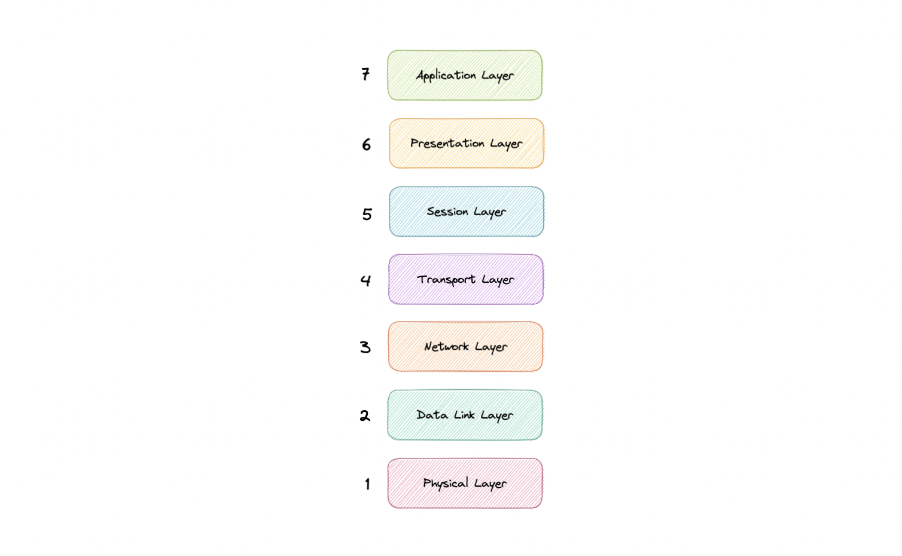

#  Mô hình OSI (Open Systems Interconnection)
Mô hình OSI là một mô hình chuẩn hóa các giao thức mạng, giúp các hệ thống khác nhau có thể giao tiếp với nhau. Mô hình này chia quá trình truyền thông thành 7 lớp, mỗi lớp có chức năng và nhiệm vụ riêng biệt.

## Tại sao mô hình OSI quan trọng?
- **Chuẩn hóa giao thức**: Mô hình OSI cung cấp một khung chuẩn để phát triển và triển khai các giao thức mạng, giúp các thiết bị và ứng dụng khác nhau có thể tương tác với nhau.
- **Tăng cường khả năng tương tác**: Các thiết bị và ứng dụng từ các nhà sản xuất khác nhau có thể giao tiếp với nhau mà không cần phải thay đổi cấu hình.
- **Hỗ trợ phát triển và bảo trì**: Mô hình OSI giúp các nhà phát triển hiểu rõ hơn về cách thức hoạt động của mạng, từ đó dễ dàng hơn trong việc phát triển và bảo trì các ứng dụng mạng.
- **Giúp khắc phục sự cố**: Khi gặp sự cố mạng, mô hình OSI giúp xác định vị trí và nguyên nhân của vấn đề một cách nhanh chóng và hiệu quả.
- **Tăng cường bảo mật**: Mô hình OSI cung cấp một cách tiếp cận có hệ thống để bảo vệ các giao thức và dữ liệu, giúp phát hiện và ngăn chặn các mối đe dọa mạng.
- **Tách biệt các chức năng phức tạp**: Mô hình OSI giúp chia nhỏ các chức năng mạng thành các thành phần đơn giản hơn, từ đó dễ dàng hơn trong việc quản lý và phát triển.
- **Khuyến khích sự phát triển của phần cứng mạng**: Mô hình OSI giúp các nhà sản xuất phần cứng phát triển các sản phẩm mạng có thể giao tiếp với nhau, từ đó tạo ra một hệ sinh thái mạng đa dạng và phong phú.

## Các lớp trong mô hình OSI

Mô hình OSI bao gồm 7 lớp, từ lớp thấp nhất (vật lý) đến lớp cao nhất (ứng dụng):

### 1. Lớp Vật lý (Physical Layer)
Lớp này bao gồm các thiết bị vật lý liên quan đến việc truyền dữ liệu, chẳng hạn như cáp và công tắc. Đây cũng là lớp mà dữ liệu được chuyển đổi thành luồng bit, là chuỗi 1 và 0. Lớp vật lý của cả hai thiết bị cũng phải thống nhất về một quy ước tín hiệu để có thể phân biệt được 1 với 0 trên cả hai thiết bị.

### 2. Lớp Liên kết dữ liệu (Data Link Layer)
Lớp liên kết dữ liệu rất giống với lớp mạng, ngoại trừ lớp liên kết dữ liệu tạo điều kiện cho việc truyền dữ liệu giữa hai thiết bị trên cùng một mạng. Lớp liên kết dữ liệu lấy các gói từ lớp mạng và chia chúng thành các phần nhỏ hơn gọi là khung.

### 3. Lớp Mạng (Network Layer)
Lớp mạng chịu trách nhiệm tạo điều kiện thuận lợi cho việc truyền dữ liệu giữa hai mạng khác nhau. Lớp mạng chia các phân đoạn từ lớp vận chuyển thành các đơn vị nhỏ hơn, được gọi là các gói, trên thiết bị của người gửi và lắp ráp lại các gói này trên thiết bị nhận. Lớp mạng cũng tìm đường dẫn vật lý tốt nhất để dữ liệu đến đích, được gọi là định tuyến. Nếu hai thiết bị giao tiếp nằm trên cùng một mạng, thì lớp mạng là không cần thiết.

### 4. Lớp Vận chuyển (Transport Layer)
Lớp vận chuyển (còn được gọi là lớp 4) chịu trách nhiệm về giao tiếp đầu cuối giữa hai thiết bị. Điều này bao gồm việc lấy dữ liệu từ lớp phiên và chia nhỏ thành các phần được gọi là phân đoạn trước khi gửi đến lớp Mạng (lớp 3). Nó cũng chịu trách nhiệm lắp ráp lại các phân đoạn trên thiết bị nhận thành dữ liệu mà lớp phiên có thể sử dụng.

### 5. Lớp Phiên (Session Layer)
Đây là lớp chịu trách nhiệm mở và đóng giao tiếp giữa hai thiết bị. Khoảng thời gian giữa khi giao tiếp được mở và đóng được gọi là phiên. Lớp phiên đảm bảo rằng phiên vẫn mở đủ lâu để truyền tất cả dữ liệu đang được trao đổi, sau đó nhanh chóng đóng phiên để tránh lãng phí tài nguyên. Lớp phiên cũng đồng bộ hóa việc truyền dữ liệu với các điểm kiểm tra.

### 6. Lớp Trình diễn (Presentation Layer)
Lớp trình bày cũng được gọi là lớp dịch. Dữ liệu từ lớp ứng dụng được trích xuất tại đây và được xử lý theo định dạng cần thiết để truyền qua mạng. Các chức năng của lớp trình bày là dịch, mã hóa/giải mã và nén.

### 7. Lớp Ứng dụng (Application Layer)
Đây là lớp duy nhất tương tác trực tiếp với dữ liệu từ người dùng. Các ứng dụng phần mềm như trình duyệt web và máy khách email dựa vào lớp ứng dụng để bắt đầu giao tiếp. Nhưng cần phải làm rõ rằng các ứng dụng phần mềm máy khách không phải là một phần của lớp ứng dụng, mà lớp ứng dụng chịu trách nhiệm về các giao thức và thao tác dữ liệu mà phần mềm dựa vào để trình bày dữ liệu có ý nghĩa cho người dùng. Các giao thức lớp ứng dụng bao gồm HTTP cũng như SMTP.